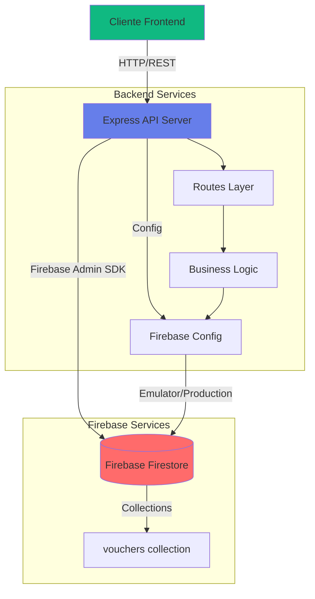

# 🎫 Backend - Generador de Tarjetas

API REST para el sistema de generación de tarjetas simbólicas tipo "Vale por...". Construido con Node.js, Express, TypeScript y Firebase Firestore.

## 📋 Tabla de Contenidos

- [One-Pager](#-one-pager)
- [Arquitectura](#-arquitectura)
- [Instalación](#-instalación)
- [Estructura del Proyecto](#-estructura-del-proyecto)
- [API Documentation](#-api-documentation)
- [Configuración](#-configuración)
- [Desarrollo](#-desarrollo)
- [Despliegue](#-despliegue)

---

## 🚀 One-Pager

### Resumen Ejecutivo

**Backend API** para gestión de tarjetas simbólicas que permite crear, leer, actualizar y eliminar vouchers con diferentes diseños visuales.

**Stack Tecnológico:**
- **Runtime:** Node.js 18+
- **Framework:** Express.js 4.18
- **Lenguaje:** TypeScript 5.3
- **Base de Datos:** Firebase Firestore
- **Autenticación:** Firebase Admin SDK
- **Containerización:** Docker

**Características Principales:**
- ✅ API RESTful completa (CRUD)
- ✅ Integración con Firebase Firestore
- ✅ Soporte para Firebase Emulator (desarrollo)
- ✅ TypeScript con tipado estricto
- ✅ Manejo de errores centralizado
- ✅ CORS configurado
- ✅ Health check endpoint

**Endpoints Principales:**
- `GET /api/vouchers` - Listar todas las tarjetas
- `POST /api/vouchers` - Crear nueva tarjeta
- `GET /api/vouchers/:id` - Obtener tarjeta específica
- `PUT /api/vouchers/:id` - Actualizar tarjeta
- `DELETE /api/vouchers/:id` - Eliminar tarjeta
- `GET /api/health` - Health check

---

## 🏗️ Arquitectura

### Diagrama de Arquitectura General



---

## 📦 Instalación

### Prerrequisitos

- Node.js 18+ 
- npm o yarn
- Firebase Project (o usar emulador)
- Docker (opcional, para desarrollo con contenedores)

### Instalación Local

```bash
# Clonar repositorio (si aplica)
cd backend

# Instalar dependencias
npm install

# Configurar variables de entorno
cp .env.example .env
# Editar .env con tus credenciales

# Iniciar en modo desarrollo
npm run dev
```

### Instalación con Docker

```bash
# Construir imagen
docker build -t mvp-backend .

# Ejecutar contenedor
docker run -p 3001:3001 \
  -e FIREBASE_PROJECT_ID=tu-project-id \
  -e USE_FIREBASE_EMULATOR=false \
  -v $(pwd)/firebase-service-account.json:/app/firebase-service-account.json \
  mvp-backend
```

---

## 📁 Estructura del Proyecto

```
backend/
├── src/
│   ├── index.ts                 # Punto de entrada de la aplicación
│   ├── config/
│   │   └── firebase.ts          # Configuración de Firebase Admin
│   ├── routes/
│   │   └── items.ts             # Rutas de la API (vouchers)
│   ├── types/                   # Definiciones de tipos TypeScript
│   └── utils/                   # Utilidades y helpers
├── functions/                   # Firebase Cloud Functions
│   ├── src/
│   │   └── index.ts
│   └── package.json
├── package.json                 # Dependencias del proyecto
├── tsconfig.json                # Configuración de TypeScript
├── firebase.json                # Configuración de Firebase
├── firestore.rules              # Reglas de seguridad de Firestore
├── firestore.indexes.json       # Índices de Firestore
├── Dockerfile                   # Configuración de Docker
└── README.md                    # Este archivo
```

### Descripción de Directorios

- **`src/index.ts`**: Configuración principal de Express, middlewares y rutas
- **`src/config/`**: Configuraciones de servicios externos (Firebase)
- **`src/routes/`**: Definición de endpoints y manejo de requests
- **`functions/`**: Firebase Cloud Functions (opcional)

---

## 📚 API Documentation

### Base URL

```
http://localhost:3001/api
```

### Endpoints

#### Health Check

```http
GET /api/health
```

**Respuesta:**
```json
{
  "status": "ok",
  "message": "Backend is running"
}
```

---

#### Listar Todas las Tarjetas

```http
GET /api/vouchers
```

**Respuesta Exitosa (200):**
```json
[
  {
    "id": "abc123",
    "valePor": "Un abrazo",
    "para": "María",
    "de": "Juan",
    "design": "classic",
    "createdAt": "2024-01-15T10:30:00.000Z",
    "updatedAt": "2024-01-15T10:30:00.000Z"
  }
]
```

---

#### Obtener Tarjeta por ID

```http
GET /api/vouchers/:id
```

**Parámetros:**
- `id` (path): ID de la tarjeta

**Respuesta Exitosa (200):**
```json
{
  "id": "abc123",
  "valePor": "Un abrazo",
  "para": "María",
  "de": "Juan",
  "design": "classic",
  "createdAt": "2024-01-15T10:30:00.000Z",
  "updatedAt": "2024-01-15T10:30:00.000Z"
}
```

**Error (404):**
```json
{
  "error": "Voucher not found"
}
```

---

#### Crear Nueva Tarjeta

```http
POST /api/vouchers
Content-Type: application/json
```

**Body:**
```json
{
  "valePor": "Un abrazo",
  "para": "María",
  "de": "Juan",
  "design": "classic"
}
```

**Campos:**
- `valePor` (string, requerido): Texto del vale
- `para` (string, opcional): Destinatario
- `de` (string, opcional): Remitente
- `design` (string, opcional): Diseño de la tarjeta (`classic`, `modern`, `festive`)

**Respuesta Exitosa (201):**
```json
{
  "id": "abc123",
  "valePor": "Un abrazo",
  "para": "María",
  "de": "Juan",
  "design": "classic",
  "createdAt": "2024-01-15T10:30:00.000Z",
  "updatedAt": "2024-01-15T10:30:00.000Z"
}
```

**Error (400):**
```json
{
  "error": "Vale por es requerido"
}
```

---

#### Actualizar Tarjeta

```http
PUT /api/vouchers/:id
Content-Type: application/json
```

**Parámetros:**
- `id` (path): ID de la tarjeta

**Body:**
```json
{
  "valePor": "Una cena",
  "para": "Pedro",
  "design": "modern"
}
```

**Respuesta Exitosa (200):**
```json
{
  "id": "abc123",
  "valePor": "Una cena",
  "para": "Pedro",
  "de": "Juan",
  "design": "modern",
  "createdAt": "2024-01-15T10:30:00.000Z",
  "updatedAt": "2024-01-15T11:00:00.000Z"
}
```

---

#### Eliminar Tarjeta

```http
DELETE /api/vouchers/:id
```

**Parámetros:**
- `id` (path): ID de la tarjeta

**Respuesta Exitosa (200):**
```json
{
  "message": "Voucher deleted successfully"
}
```

---

### Códigos de Estado HTTP

| Código | Descripción |
|--------|-------------|
| 200 | OK - Solicitud exitosa |
| 201 | Created - Recurso creado exitosamente |
| 400 | Bad Request - Error en la solicitud |
| 404 | Not Found - Recurso no encontrado |
| 500 | Internal Server Error - Error del servidor |

---

## ⚙️ Configuración

### Variables de Entorno

Crear archivo `.env` en la raíz del proyecto:

```env
# Firebase Configuration
FIREBASE_PROJECT_ID=tu-project-id
USE_FIREBASE_EMULATOR=false

# Server Configuration
PORT=3001
NODE_ENV=development

# Firebase Emulator (solo si USE_FIREBASE_EMULATOR=true)
FIRESTORE_EMULATOR_HOST=localhost:8080
FIREBASE_AUTH_EMULATOR_HOST=localhost:9099

# Firebase Credentials (solo si USE_FIREBASE_EMULATOR=false)
GOOGLE_APPLICATION_CREDENTIALS=./firebase-service-account.json
```

### Configuración de Firebase

#### Opción 1: Firebase Real (Producción)

1. Obtener `firebase-service-account.json` desde Firebase Console
2. Colocar en la raíz del proyecto `backend/`
3. Configurar `USE_FIREBASE_EMULATOR=false`

#### Opción 2: Firebase Emulator (Desarrollo)

1. Instalar Firebase Tools: `npm install -g firebase-tools`
2. Configurar `USE_FIREBASE_EMULATOR=true`
3. Iniciar emulador: `npm run emulators`

---

## 🛠️ Desarrollo

### Scripts Disponibles

```bash
# Desarrollo con hot-reload
npm run dev

# Compilar TypeScript
npm run build

# Ejecutar en producción
npm start

# Iniciar Firebase Emulators
npm run emulators

# Linting
npm run lint
```

### Estructura de Datos

#### Voucher Schema

```typescript
interface Voucher {
  id: string;                    // ID generado por Firestore
  valePor: string;              // Texto del vale (requerido)
  para: string;                 // Destinatario (opcional)
  de: string;                   // Remitente (opcional)
  design: string;                // Diseño: 'classic' | 'modern' | 'festive'
  createdAt: string;            // ISO timestamp
  updatedAt: string;            // ISO timestamp
}
```

#### Firestore Collection

**Collection:** `vouchers`

**Document Structure:**
```json
{
  "valePor": "Un abrazo",
  "para": "María",
  "de": "Juan",
  "design": "classic",
  "createdAt": "2024-01-15T10:30:00.000Z",
  "updatedAt": "2024-01-15T10:30:00.000Z"
}
```

---

## 🐳 Despliegue

### Docker

```bash
# Construir imagen
docker build -t mvp-backend .

# Ejecutar
docker run -d \
  --name mvp-backend \
  -p 3001:3001 \
  -e FIREBASE_PROJECT_ID=tu-project-id \
  -e USE_FIREBASE_EMULATOR=false \
  -v $(pwd)/firebase-service-account.json:/app/firebase-service-account.json \
  mvp-backend
```

### Docker Compose

Ver `docker-compose.yml` en la raíz del proyecto para configuración completa.

### Variables de Entorno en Producción

Asegúrate de configurar:
- `FIREBASE_PROJECT_ID`
- `USE_FIREBASE_EMULATOR=false`
- `GOOGLE_APPLICATION_CREDENTIALS` o credenciales en el sistema
- `NODE_ENV=production`

---

## 🔒 Seguridad

### Firestore Rules

Las reglas actuales permiten lectura/escritura completa (solo para desarrollo). En producción, implementa autenticación:

```javascript
rules_version = '2';
service cloud.firestore {
  match /databases/{database}/documents {
    match /vouchers/{voucherId} {
      allow read, write: if request.auth != null;
    }
  }
}
```

### CORS

CORS está configurado para permitir todas las solicitudes. En producción, restringe a dominios específicos:

```typescript
app.use(cors({
  origin: 'https://tu-dominio.com'
}));
```

---

## 📊 Monitoreo y Logs

### Health Check

Endpoint disponible para monitoreo:
```http
GET /api/health
```

### Logs

Los logs se muestran en la consola. En producción, considera usar:
- Winston
- Morgan (HTTP logger)
- Cloud Logging (GCP)

---

## 🧪 Testing

### Ejemplos con cURL

```bash
# Health check
curl http://localhost:3001/api/health

# Crear tarjeta
curl -X POST http://localhost:3001/api/vouchers \
  -H "Content-Type: application/json" \
  -d '{
    "valePor": "Un café",
    "para": "Ana",
    "de": "Carlos",
    "design": "modern"
  }'

# Listar tarjetas
curl http://localhost:3001/api/vouchers

# Obtener tarjeta
curl http://localhost:3001/api/vouchers/{id}

# Actualizar tarjeta
curl -X PUT http://localhost:3001/api/vouchers/{id} \
  -H "Content-Type: application/json" \
  -d '{"valePor": "Una cena"}'

# Eliminar tarjeta
curl -X DELETE http://localhost:3001/api/vouchers/{id}
```

---

## 🐛 Troubleshooting

### Error: "Firebase credentials not found"

- Verifica que `firebase-service-account.json` exista
- Verifica que `FIREBASE_PROJECT_ID` esté configurado
- Verifica permisos del archivo de credenciales

### Error: "Cannot connect to Firestore"

- Verifica que Firebase Emulator esté corriendo (si usas emulador)
- Verifica credenciales de Firebase (si usas producción)
- Verifica conectividad de red

### Error: "Port already in use"

- Cambia el puerto en `.env`: `PORT=3002`
- O detén el proceso que usa el puerto 3001

---

## 📝 Licencia

MIT

---

## 👥 Contribución

1. Fork el proyecto
2. Crea una rama para tu feature (`git checkout -b feature/AmazingFeature`)
3. Commit tus cambios (`git commit -m 'Add some AmazingFeature'`)
4. Push a la rama (`git push origin feature/AmazingFeature`)
5. Abre un Pull Request

---

## 📞 Soporte

Para problemas o preguntas, abre un issue en el repositorio.

