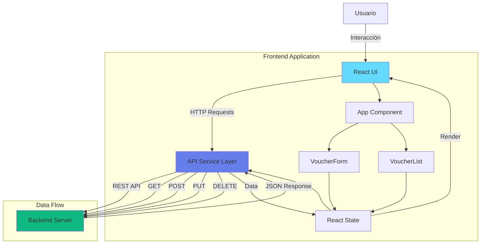
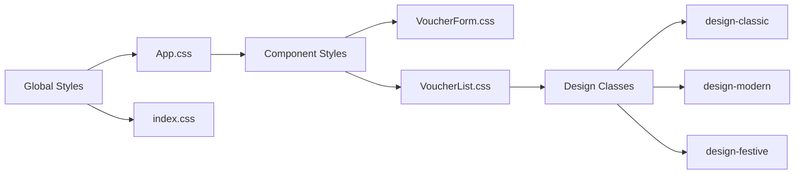

# 🎨 Frontend - Generador de Tarjetas

Aplicación web React para crear y gestionar tarjetas simbólicas tipo "Vale por...". Construida con React 18, TypeScript, Vite y estilos CSS modernos.

## 📋 Tabla de Contenidos

- [One-Pager](#-one-pager)
- [Arquitectura](#-arquitectura)
- [Instalación](#-instalación)
- [Estructura del Proyecto](#-estructura-del-proyecto)
- [Componentes](#-componentes)
- [Estilos y Diseños](#-estilos-y-diseños)
- [Desarrollo](#-desarrollo)
- [Despliegue](#-despliegue)

---

## 🚀 One-Pager

### Resumen Ejecutivo

**Frontend React** para la creación y visualización de tarjetas simbólicas con tres diseños únicos y funcionalidad completa de CRUD.

**Stack Tecnológico:**
- **Framework:** React 18.2
- **Lenguaje:** TypeScript 5.3
- **Build Tool:** Vite 5.0
- **HTTP Client:** Axios 1.6
- **Estilos:** CSS3 con gradientes y efectos modernos
- **Containerización:** Docker

**Características Principales:**
- ✅ Interfaz de usuario moderna y responsive
- ✅ Tres diseños visuales únicos (Clásico, Moderno, Festivo)
- ✅ CRUD completo de tarjetas
- ✅ Integración con API REST
- ✅ Manejo de estados y errores
- ✅ Diseño responsive (mobile-first)
- ✅ Hot-reload en desarrollo

**Funcionalidades:**
- Crear tarjetas con texto personalizado
- Seleccionar entre 3 diseños visuales
- Editar tarjetas existentes
- Eliminar tarjetas
- Visualización en grid responsive

---

## 🏗️ Arquitectura

### Diagrama de Arquitectura General


---

## 📦 Instalación

### Prerrequisitos

- Node.js 18+
- npm o yarn
- Backend API corriendo (puerto 3001)

### Instalación Local

```bash
# Navegar al directorio
cd frontend

# Instalar dependencias
npm install

# Configurar variables de entorno (opcional)
# Crear .env.local
echo "VITE_API_URL=http://localhost:3001" > .env.local

# Iniciar servidor de desarrollo
npm start
# o
npm run dev
```

La aplicación estará disponible en `http://localhost:3000`

### Instalación con Docker

```bash
# Construir imagen
docker build -t mvp-frontend .

# Ejecutar contenedor
docker run -p 3000:3000 \
  -e VITE_API_URL=http://localhost:3001 \
  mvp-frontend
```

---

## 📁 Estructura del Proyecto

```
frontend/
├── src/
│   ├── main.tsx              # Punto de entrada de React
│   ├── App.tsx               # Componente principal
│   ├── App.css               # Estilos globales de la app
│   ├── index.css             # Estilos base y reset
│   ├── vite-env.d.ts         # Tipos de Vite
│   ├── components/
│   │   ├── VoucherForm.tsx   # Formulario de creación
│   │   ├── VoucherForm.css   # Estilos del formulario
│   │   ├── VoucherList.tsx   # Lista de tarjetas
│   │   └── VoucherList.css   # Estilos de la lista
│   └── services/
│       └── api.ts            # Cliente HTTP (Axios)
├── public/                   # Archivos estáticos
├── index.html                # HTML principal
├── package.json              # Dependencias
├── tsconfig.json             # Configuración TypeScript
├── vite.config.ts            # Configuración de Vite
├── Dockerfile                # Configuración Docker
└── README.md                 # Este archivo
```

### Descripción de Archivos

- **`src/main.tsx`**: Punto de entrada, renderiza la app React
- **`src/App.tsx`**: Componente principal que orquesta la aplicación
- **`src/components/VoucherForm.tsx`**: Formulario para crear/editar tarjetas
- **`src/components/VoucherList.tsx`**: Lista y visualización de tarjetas
- **`src/services/api.ts`**: Cliente HTTP para comunicación con el backend

---

## 🧩 Componentes

### App Component

**Ubicación:** `src/App.tsx`

**Responsabilidades:**
- Gestión del estado global de tarjetas
- Manejo de errores
- Coordinación entre formulario y lista
- Llamadas a la API

**Estado:**
```typescript
const [vouchers, setVouchers] = useState<Voucher[]>([])
const [loading, setLoading] = useState(true)
const [error, setError] = useState<string | null>(null)
```

**Métodos Principales:**
- `fetchVouchers()`: Obtiene todas las tarjetas
- `handleAddVoucher()`: Crea nueva tarjeta
- `handleUpdateVoucher()`: Actualiza tarjeta existente
- `handleDeleteVoucher()`: Elimina tarjeta

---

### VoucherForm Component

**Ubicación:** `src/components/VoucherForm.tsx`

**Props:**
```typescript
interface VoucherFormProps {
  onSubmit: (voucher: Omit<Voucher, 'id'>) => void
}
```

**Funcionalidad:**
- Formulario con validación
- Campos: `valePor`, `para`, `de`, `design`
- Selector de diseño visual
- Manejo de estado de envío

**Estados:**
```typescript
const [valePor, setValePor] = useState('')
const [para, setPara] = useState('')
const [de, setDe] = useState('')
const [design, setDesign] = useState('classic')
const [submitting, setSubmitting] = useState(false)
```

---

### VoucherList Component

**Ubicación:** `src/components/VoucherList.tsx`

**Props:**
```typescript
interface VoucherListProps {
  vouchers: Voucher[]
  onUpdate: (id: string, voucher: Partial<Voucher>) => void
  onDelete: (id: string) => void
}
```

**Funcionalidad:**
- Renderizado de tarjetas en grid
- Modo de edición inline
- Eliminación de tarjetas
- Aplicación de estilos según diseño

**Estados:**
```typescript
const [editingId, setEditingId] = useState<string | null>(null)
const [editValePor, setEditValePor] = useState('')
const [editPara, setEditPara] = useState('')
const [editDe, setEditDe] = useState('')
const [editDesign, setEditDesign] = useState('classic')
```

---

## 🎨 Estilos y Diseños

### Diseños Disponibles

La aplicación incluye tres diseños visuales únicos:

#### 1. Clásico Elegante (`classic`)

**Características:**
- Estilo vintage con bordes dobles
- Colores tierra y beige
- Tipografía serif (Georgia)
- Patrones decorativos en bordes

**Uso:** Ideal para ocasiones formales o elegantes

#### 2. Moderno Geométrico (`modern`)

**Características:**
- Patrones geométricos sutiles
- Colores azules y blancos
- Tipografía sans-serif en mayúsculas
- Bordes minimalistas

**Uso:** Ideal para un look contemporáneo y profesional

#### 3. Festivo Colorido (`festive`)

**Características:**
- Gradiente multicolor vibrante
- Bordes múltiples de colores
- Emojis decorativos
- Fondo semitransparente

**Uso:** Ideal para ocasiones festivas y alegres

### Sistema de Estilos



### Responsive Design

**Breakpoints:**
- Mobile: < 768px (una columna)
- Tablet: 768px - 1024px (dos columnas)
- Desktop: > 1024px (grid flexible)

**Grid System:**
```css
.voucher-list {
  display: grid;
  grid-template-columns: repeat(auto-fill, minmax(300px, 1fr));
  gap: 1.5rem;
}
```

---

## 🛠️ Desarrollo

### Scripts Disponibles

```bash
# Desarrollo con hot-reload
npm start
# o
npm run dev

# Compilar para producción
npm run build

# Preview de build de producción
npm run preview

# Linting (si está configurado)
npm run lint
```

### Variables de Entorno

Crear archivo `.env.local`:

```env
# URL del backend API
VITE_API_URL=http://localhost:3001

# Firebase (opcional, si se usa directamente)
VITE_FIREBASE_PROJECT_ID=tu-project-id
```

### Hot Reload

Vite proporciona hot-reload automático. Los cambios en:
- Componentes React se reflejan instantáneamente
- Estilos CSS se actualizan sin recargar
- TypeScript se compila automáticamente

---

## 📡 Integración con API

### API Service

**Ubicación:** `src/services/api.ts`

**Métodos Disponibles:**

```typescript
// Obtener todas las tarjetas
api.getVouchers(): Promise<Voucher[]>

// Obtener tarjeta por ID
api.getVoucher(id: string): Promise<Voucher>

// Crear nueva tarjeta
api.createVoucher(voucher: Omit<Voucher, 'id'>): Promise<Voucher>

// Actualizar tarjeta
api.updateVoucher(id: string, voucher: Partial<Voucher>): Promise<Voucher>

// Eliminar tarjeta
api.deleteVoucher(id: string): Promise<void>
```

### Manejo de Errores

```typescript
try {
  const vouchers = await api.getVouchers()
  setVouchers(vouchers)
} catch (err: any) {
  setError(err.message || 'Error al cargar tarjetas')
  console.error('Error:', err)
}
```

---

## 🎯 Tipos TypeScript

### Voucher Interface

```typescript
export interface Voucher {
  id: string
  valePor: string
  para: string
  de: string
  design: string
  createdAt?: string
  updatedAt?: string
}
```

### Design Types

```typescript
type DesignType = 'classic' | 'modern' | 'festive'
```

---

## 🐳 Despliegue

### Build de Producción

```bash
# Compilar
npm run build

# Los archivos estarán en dist/
```

### Docker

```bash
# Construir imagen
docker build -t mvp-frontend .

# Ejecutar
docker run -p 3000:3000 \
  -e VITE_API_URL=https://api.tu-dominio.com \
  mvp-frontend
```

### Variables de Entorno en Producción

Asegúrate de configurar:
- `VITE_API_URL`: URL del backend en producción
- Variables de Firebase si aplica

---

## 🎨 Guía de Estilos

### Colores Principales

```css
/* Gradiente principal */
background: linear-gradient(135deg, #667eea 0%, #764ba2 100%);

/* Colores de diseño */
--classic-primary: #8b7355;
--modern-primary: #2563eb;
--festive-primary: #ff6b6b;
```

### Tipografía

- **Fuente principal:** System fonts (-apple-system, BlinkMacSystemFont, 'Segoe UI', 'Roboto')
- **Fuente clásica:** Georgia (serif)
- **Tamaños:** Responsive con rem

### Espaciado

- **Gap estándar:** 1rem
- **Padding de tarjetas:** 2rem
- **Border radius:** 16px (tarjetas), 6px (botones)

---

## 🧪 Testing Manual

### Flujo de Usuario

1. **Crear Tarjeta:**
   - Llenar formulario
   - Seleccionar diseño
   - Click en "Crear Tarjeta"
   - Verificar que aparece en la lista

2. **Editar Tarjeta:**
   - Click en "Editar"
   - Modificar campos
   - Click en "Guardar"
   - Verificar cambios

3. **Eliminar Tarjeta:**
   - Click en "Eliminar"
   - Confirmar (si aplica)
   - Verificar que desaparece

---

## 🐛 Troubleshooting

### Error: "Cannot connect to API"

- Verifica que el backend esté corriendo
- Verifica `VITE_API_URL` en `.env.local`
- Verifica CORS en el backend

### Error: "Module not found"

```bash
# Reinstalar dependencias
rm -rf node_modules package-lock.json
npm install
```

### Error: "Port 3000 already in use"

```bash
# Cambiar puerto en vite.config.ts
server: {
  port: 3001
}
```

---

## 📊 Performance

### Optimizaciones

- **Code Splitting:** Vite lo hace automáticamente
- **Lazy Loading:** Considerar para componentes grandes
- **Memoización:** Usar `useMemo` y `useCallback` si es necesario

### Bundle Size

- **Desarrollo:** ~2-3 MB (con source maps)
- **Producción:** ~200-300 KB (minificado y comprimido)

---

## 🔒 Seguridad

### Buenas Prácticas

- Validar inputs en el frontend
- Sanitizar datos antes de enviar
- No exponer credenciales en el código
- Usar HTTPS en producción

---

## 📝 Licencia

MIT

---

## 👥 Contribución

1. Fork el proyecto
2. Crea una rama (`git checkout -b feature/AmazingFeature`)
3. Commit cambios (`git commit -m 'Add AmazingFeature'`)
4. Push a la rama (`git push origin feature/AmazingFeature`)
5. Abre un Pull Request

---

## 📞 Soporte

Para problemas o preguntas, abre un issue en el repositorio.

